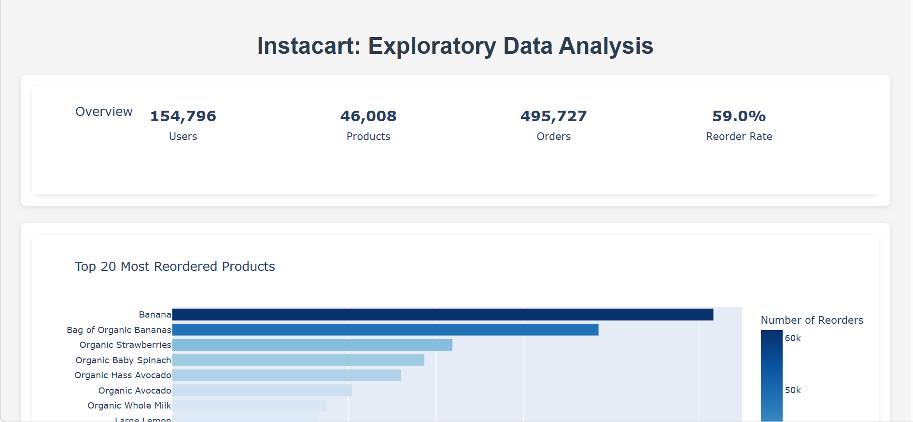
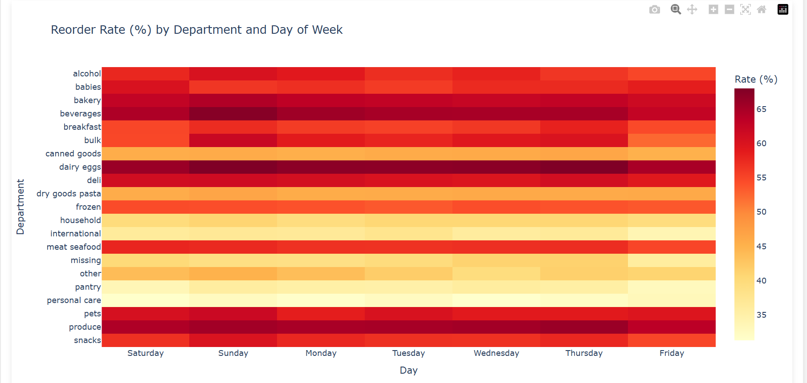
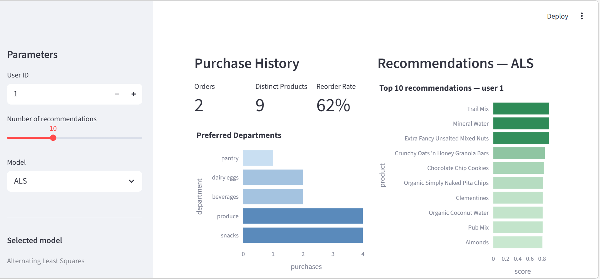
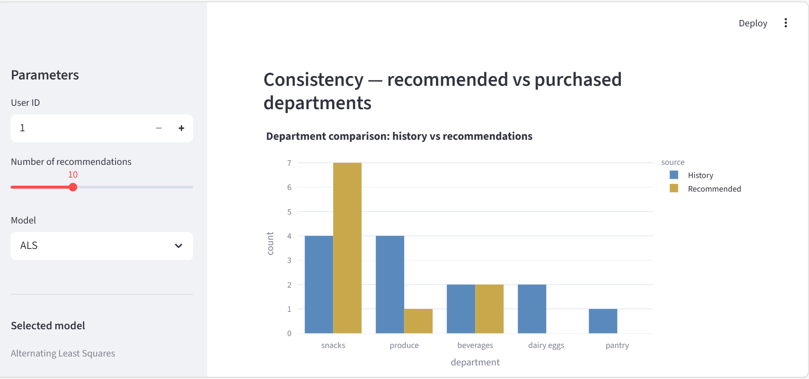

# Instacart Recommender System

Product recommendation system for Instacart based on collaborative filtering.

## Project Objective

The goal is to recommend products that may interest a user based on their purchase history and the purchasing patterns of similar users.

This project implements three recommendation algorithms:
- **ALS** and **BPR** via the `implicit` library (optimized for implicit data)
- **EASE** implemented from scratch in NumPy/SciPy (linear autoencoder with closed form)

Everything is exposed via a **REST API** (FastAPI) and an **interactive interface** (Streamlit), with experiment tracking via **MLflow** and hyperparameter optimization via **Optuna**.

## Context

This project uses the public [Instacart Market Basket Analysis](https://www.kaggle.com/datasets/yasserh/instacart-online-grocery-basket-analysis-dataset) dataset available on Kaggle.

The dataset contains the purchase history of Instacart customers:

- **32 million** purchase lines
- **206,209** users
- **49,688** products
- **3.4 million** orders

We work here with **implicit feedback**: we don't have explicit ratings (1 to 5 stars) but we know which products each user has purchased. The idea is to learn preferences from these interactions. A user who often buys bananas probably has a preference for bananas, even if they never explicitly said so.

## Installation

### Prerequisites

- Python 3.11+
- pip

### Local installation
```bash
# Clone the repo
git clone https://github.com/Fama05-afk/instacart-recsys.git
cd instacart-recsys

# Create a virtual environment
python -m venv venv
source venv/bin/activate  # Linux/Mac
venv\Scripts\activate     # Windows

# Install dependencies
pip install -r requirements.txt
```

### Data

1. Download the dataset from [Kaggle](https://www.kaggle.com/datasets/yasserh/instacart-online-grocery-basket-analysis-dataset)
2. Extract the CSV files into `data/raw/`
```
data/raw/
├── aisles.csv
├── departments.csv
├── products.csv
├── orders.csv
├── order_products__prior.csv
└── order_products__train.csv
```

## Data Preparation

### Exploration and Merging

The first step is to understand and prepare the data. The `notebooks/exploration_data.ipynb` notebook allows you to:

- Explore the structure of different tables (orders, products, aisles, departments)
- Visualize distributions (most purchased products, order hours, etc.)
- Merge tables to obtain a final usable file

The result is a `data/processed/prior_merged.csv` file that contains all the information needed to build the matrix.

### Dashboard
```bash
python scripts/dashboard.py
```

This script generates an interactive Plotly dashboard (`data/processed/plots/dashboard.html`) with several visualizations: global KPIs, top reordered products, reorder rate by department, purchase patterns by hour and day of week.




## Sparse Matrix Construction

Before training the models, we need to build a user-item matrix. This matrix represents the interactions between users and products.

**Why a sparse matrix?** With 206k users and 50k products, a dense matrix would occupy about 80 GB of memory. However, each user only purchases a tiny fraction of available products. The matrix is therefore extremely sparse: more than 99.9% of the values are zeros.

We use SciPy's CSR (Compressed Sparse Row) format which only stores non-zero values. This reduces memory usage to a few hundred MB and speeds up matrix operations.

The `src/data/matrix_builder.py` script handles:
1. Loading the merged data
2. Creating mappings `user_id -> index` and `product_id -> index`
3. Building the sparse matrix in CSR format with purchase frequency as the signal
4. Saving `matrix.pkl` and `mappings.pkl` in `data/processed/`
```bash
python src/data/matrix_builder.py
```

## Model Training

Once the matrix is built, we can train the three models via a unified script:
```bash
# Train a specific model
python scripts/train.py --model als
python scripts/train.py --model bpr
python scripts/train.py --model ease

# Train all three at once
python scripts/train.py --model all

# Force matrix reconstruction before training
python scripts/train.py --model all --rebuild-matrix
```

Each model reads its hyperparameters from `configs/` and automatically registers the run and model in **MLflow Model Registry**.

## Hyperparameter Tuning

Tuning uses Optuna to find the best hyperparameters for each model. Optuna intelligently explores the parameter space using Bayesian algorithms (TPE sampler).
```bash
python scripts/tune_als.py   # ALS  — 15 trials
python scripts/tune_bpr.py   # BPR  — 10 trials
python scripts/tune_ease.py  # EASE — 10 trials
```

The best parameters found are saved in the `configs/` folder:
- `best_params_als.json`: ALS (factors: 99, iterations: 27)
- `best_params_bpr.json`: BPR (factors: 57, iterations: 73)
- `best_params_ease.json`: EASE (lambda_: 88.9)

Each trial is logged in MLflow (parent run + nested runs per trial).

## Tracking with MLflow

Each training run and each Optuna trial is automatically logged in MLflow. This allows you to:

- Keep track of hyperparameters used
- Compare performance between different experiments
- Reproduce results
- Access models via the Model Registry

To visualize experiments:
```bash
mlflow ui --backend-store-uri sqlite:///mlflow.db
```

The interface is accessible at `http://localhost:5000`.

## Evaluation
```bash
# Evaluate a specific model
python scripts/evaluate.py --model als
python scripts/evaluate.py --model bpr
python scripts/evaluate.py --model ease

# Evaluate all three and display comparison
python scripts/evaluate.py --model all --n-users 10000
```

### Metrics Used

**Hit Rate @ k**: main metric. It measures the proportion of users for whom at least one recommended product is among the products actually purchased in the next order.

Specifically, for each user in the test set:
1. Generate the top-k recommendations
2. Check if at least one of these recommendations corresponds to a product the user actually purchased
3. Calculate the percentage of users for whom this is the case

**NDCG @ k**: penalizes relevant recommendations that appear late in the list. A good product in position 1 is worth more than in position 10.

### Results on 10,000 Users

| Model | Hit Rate @10 | NDCG @10 |
|--------|-------------|----------|
| **ALS** | **16.2%** | **0.0247** |
| EASE | 14.6% | 0.0229 |
| BPR | 14.6% | 0.0224 |

ALS achieves the best performance. EASE is remarkable given its simplicity, no iterative training just a matrix inversion. This result aligns with the conclusions of Dacrema et al. (2019): simple well-tuned methods often compete with more complex approaches.

## REST API

The API allows you to get product recommendations for a given user. It is built with FastAPI.

### Launch the API
```bash
uvicorn src.api.main:app --reload --host 0.0.0.0 --port 8000
```

### Endpoints

| Method | Endpoint | Description |
|---------|----------|-------------|
| GET | `/health` | Check that the API is operational |
| GET | `/models` | Return metrics for all three models |
| GET | `/recommend/{user_id}` | Return recommendations for a user |

### Parameters for `/recommend/{user_id}`

- `user_id` (path): User ID (required)
- `n` (query): Number of recommendations to return (default: 10)
- `model_name` (query): Model to use : `als`, `bpr` or `ease` (default: als)

### Examples
```bash
# ALS recommendations (default)
curl "http://localhost:8000/recommend/12345?n=10"

# EASE recommendations
curl "http://localhost:8000/recommend/12345?n=10&model_name=ease"

# BPR recommendations
curl "http://localhost:8000/recommend/12345?n=10&model_name=bpr"

# Model metrics
curl "http://localhost:8000/models"
```

### Response
```json
{
  "user_id": 12345,
  "model": "ease",
  "recommendations": [
    {"product": "Banana", "score": 0.8542},
    {"product": "Organic Strawberries", "score": 0.7231},
    {"product": "Bag of Organic Bananas", "score": 0.6918}
  ]
}
```

## Streamlit Interface

The interactive interface lets you explore recommendations for any user, compare models, and verify consistency between purchase history and recommendations.



The consistency section compares the departments in the user's history with those of the recommended products, allowing visual verification that the model makes coherent suggestions.



```bash
streamlit run src/ui/app.py
```

The interface is accessible at `http://localhost:8501`. The API must be running beforehand.

### Features

**Sidebar**:
- User selection by ID
- Number of recommendations choice (5 to 20)
- Model selection with performance display

**Left column (history)**:
- Metrics: number of orders, distinct products, reorder rate
- Chart of preferred departments
- Table of most purchased products

**Right column (recommendations)**:
- Chart of top-N recommendations with their scores
- Detailed table with department for each recommended product

**Consistency section**:
- Comparison between departments in history and those in recommendations
- Allows visual verification that the model recommends consistent products

## Docker Deployment

Docker allows you to run the entire system (API + Streamlit interface) in isolated containers, without worrying about local dependencies or environment configuration. Everything is pre-configured and ready to run.

**Prerequisites**: [Docker Desktop](https://www.docker.com/products/docker-desktop/) installed and running.
```bash
docker-compose up --build
```

This launches two containers simultaneously:
- **API**: `http://localhost:8000` : REST endpoints for recommendations
- **Streamlit**: `http://localhost:8501` : interactive interface

The API must start before Streamlit can display recommendations (`depends_on` is already configured in `docker-compose.yml`).

## Algorithms

### ALS (Alternating Least Squares)

*Implementation: `implicit` library*

Matrix factorization optimized for implicit data. The idea is to decompose the user-item matrix into two latent factor matrices (one for users, one for products). The algorithm alternates between updating user and product factors until convergence.

Main hyperparameters:
- `factors`: embedding dimension (99 after tuning)
- `iterations`: number of passes (27)
- `regularization`: L2 regularization
- `alpha`: implicit interaction weight

### BPR (Bayesian Personalized Ranking)

*Implementation: `implicit` library*

Directly optimizes product ranking for each user. Rather than predicting absolute scores, BPR learns to order: for a given user, a purchased product should be ranked higher than a non-purchased product. Training uses negative sampling (triplets: user, positive item, negative item).

Main hyperparameters:
- `factors`: embedding dimension (57)
- `iterations`: number of epochs (73)
- `learning_rate`: learning step (0.0013)
- `regularization`: L2 regularization (0.054)

### EASE (Embarrassingly Shallow Autoencoder)

*Implementation: from scratch (NumPy/SciPy)*

Linear autoencoder without hidden layer. Despite its apparent simplicity, it performs very well thanks to L2 regularization on weights. The solution has a  mathematical formula that gives the exact solution in one step without iterative training:
```
B = (X^T X + λI)^(-1)
```

Where `X` is the user-item matrix and `λ` the regularization parameter. No iterative training: a single matrix inversion suffices. To manage memory, we only keep the 10,000 most purchased products.

Hyperparameter:
- `lambda_`: regularization (88.9 after tuning)

## Project Structure
```
instacart-recsys/
│
├── configs/                       # Optimized hyperparameters
│   ├── best_params_als.json
│   ├── best_params_bpr.json
│   └── best_params_ease.json
│
├── data/
│   ├── raw/                       # Original Instacart dataset
│   └── processed/                 # Transformed data
│       ├── matrix.pkl             # Sparse matrix
│       ├── mappings.pkl           # ID <-> index mappings
│       └── prior_merged.csv       # Merged data
│
├── models/                        # Trained models
│   ├── als_model.pkl
│   ├── bpr_model.pkl
│   └── ease_model.pkl
│
├── mlruns/                        # MLflow tracking
│
├── notebooks/
│   └── exploration_data.ipynb     # EDA
│
├── scripts/                       # Executable scripts
│   ├── train.py                   # Unified training (--model als/bpr/ease/all)
│   ├── evaluate.py                # Unified evaluation (--model als/bpr/ease/all)
│   ├── tune_als.py                # ALS tuning
│   ├── tune_bpr.py                # BPR tuning
│   ├── tune_ease.py               # EASE tuning
│   └── dashboard.py               # EDA visualizations
│
├── src/
│   ├── api/
│   │   └── main.py                # FastAPI API
│   ├── data/
│   │   └── matrix_builder.py      # Matrix construction
│   ├── models/
│   │   ├── als_model.py
│   │   ├── bpr_model.py
│   │   └── ease_model.py
│   ├── evaluation/
│   │   └── evaluator.py           # Metrics computation
│   └── ui/
│       └── app.py                 # Streamlit interface
│
├── docker-compose.yml
├── Dockerfile.api
├── Dockerfile.streamlit
└── requirements.txt
```

## Tech Stack

| Category | Technologies |
|-----------|--------------|
| ML | NumPy, Pandas, SciPy, implicit |
| MLOps | MLflow, Optuna |
| API | FastAPI, Uvicorn, Pydantic |
| UI | Streamlit |
| Visualization | Plotly, Matplotlib, Seaborn |
| Deployment | Docker, Docker Compose |

## References

- Hu, Koren, Volinsky (2008), *Collaborative Filtering for Implicit Feedback Datasets*
- Rendle et al. (2009), *BPR: Bayesian Personalized Ranking from Implicit Feedback*
- Steck (2019), *Embarrassingly Shallow Autoencoders for Sparse Data*
- Dacrema et al. (2019), *Are We Really Making Much Progress? A Worrying Analysis of Recent Neural Recommendation Approaches*

## License

MIT

## Author

Fama Diallo — [GitHub](https://github.com/Fama05-afk)